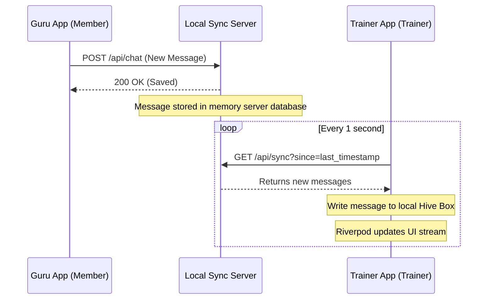

# Architecture Documentation

This document explains the architecture of the WTF Flutter Test monorepo, showing how the shared package, client applications, and local sync server interact.

## Monorepo Layout

```
wtf_flutter_test/
├─ token_server/         # Express Node.js Server (Token Gen & State Sync)
├─ shared/               # Dart/Flutter package shared by both apps
│  ├─ lib/
│  │  ├─ models/         # User, Message, CallRequest, SessionLog, RoomMeta
│  │  ├─ services/       # AuthService, ChatService, CallService, LogService
│  │  ├─ utils/          # Theme, Logger, DevPanel logs
│  │  └─ widgets/        # DevPanel UI, general inputs, buttons
├─ guru_app/             # Member Application (Depends on shared)
└─ trainer_app/          # Trainer Application (Depends on shared)
```

## Data Sync & Real-Time Feel

Since both apps run locally in isolation:
1. **Local Storage (Hive)**: Both apps write all records (Messages, Call Requests, Sessions) to their respective local Hive databases first.
2. **Local Sync Server**: A Node.js backend runs at `http://localhost:3000`.
3. **Polling Sync Loop**: Both apps run a periodic sync service (using a Riverpod Timer-based loop) that polls `GET /api/sync?since=timestamp` every 1 second.
4. **Real-time UI**: The Riverpod state providers watch the local Hive boxes. When the sync loop fetches updates and writes them to Hive, the UI automatically rebuilds, creating a seamless, real-time feel.



## Services Layer

All business logic is abstracted into services inside `shared/lib/services/`:
- `AuthService`: Handles user profiles, onboarding progress, and current session caching.
- `ChatService`: Manages chat list, conversations, message statuses (sending -> sent -> read), and simulated typing indicators.
- `CallService`: Performs call scheduling, conflict checks (blocking double-booked slots), and wraps the 100ms video call SDK.
- `LogService`: Keeps track of session logs, ratings, and provides exporting utilities.
